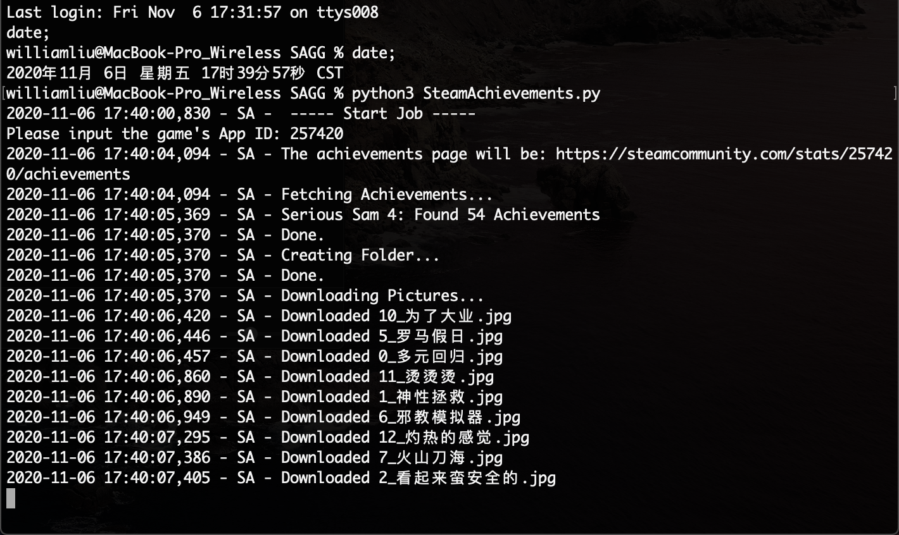
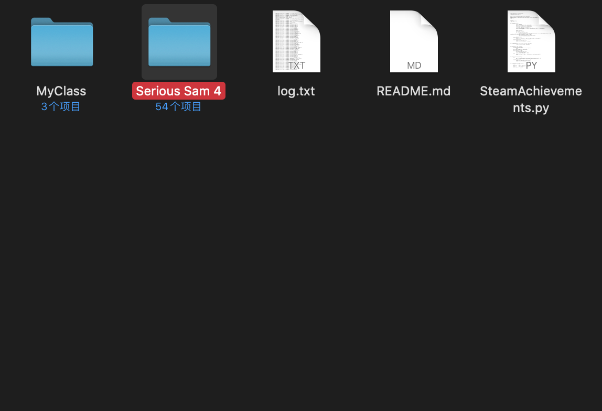
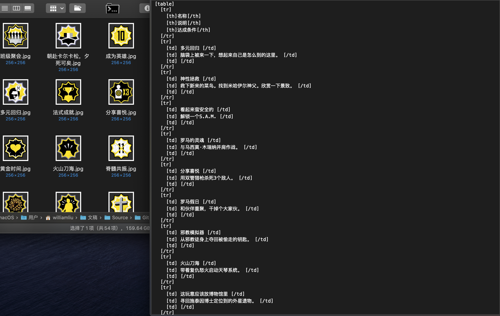
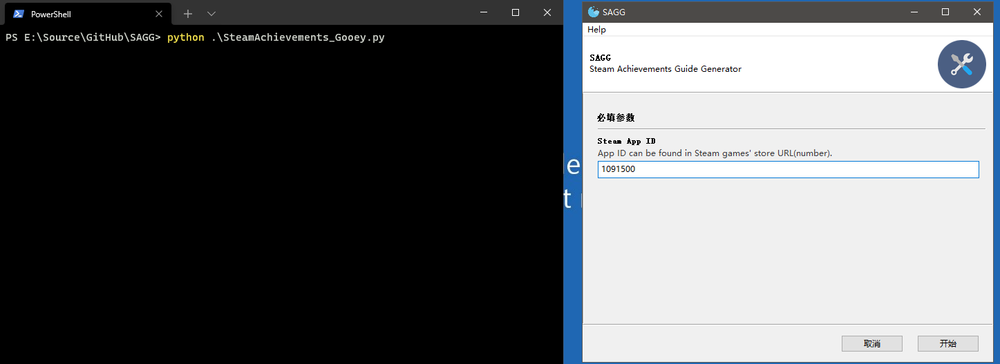
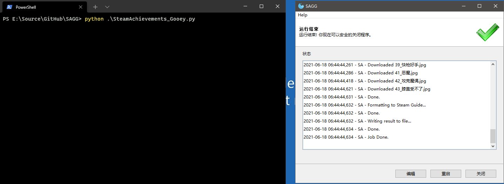
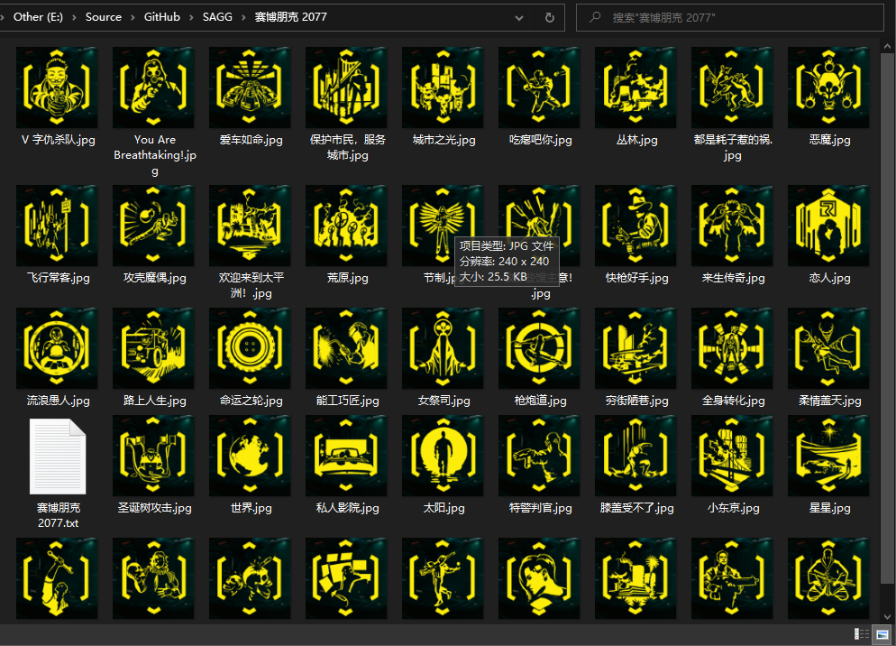

# SAGG
Steam Achievements Guide Generator

# Archived, move to [https://github.com/azhuge233/SAGG-dotnet](https://github.com/azhuge233/SAGG-dotnet)

This script will simply fetch the given game's achievements page then download all the achievement icons and generate a 3-columns table in [steam format](https://steamcommunity.com/comment/Guide/formattinghelp) contains achievement title, description and custom description.

This idea came into my head after I wrote a achievements guide about Serious Sam 4, it just so painful I have to copy/paste so many times to create a table and take so many screenshots to get the achievement icons.

## Requirements

- Python 3.5+
    - multiprocessing
    - Beautiful Soup 4
    - lxml

## Usage

Clone the repository first

```shell
git clone https://github.com/azhuge233/SAGG.git
cd SAGG
```

### CLI

Run

```shell
python3 SteamAchievements.py
```

### GUI

Run

```shell
python3 SteamAchievements_Gooey.py
```

Then type in the steam game's App ID, which can be found when you open the game's store page, it's in the URL, or you can search App ID at [SteamDB](https://steamdb.info).

The results will be stored in the directory named after the game's name.

The results will be in Chinese by default, you can change the Accept-Language header in SteamAchievements.py to English only to get the English results.

## Screenshots

### CLI







### GUI






